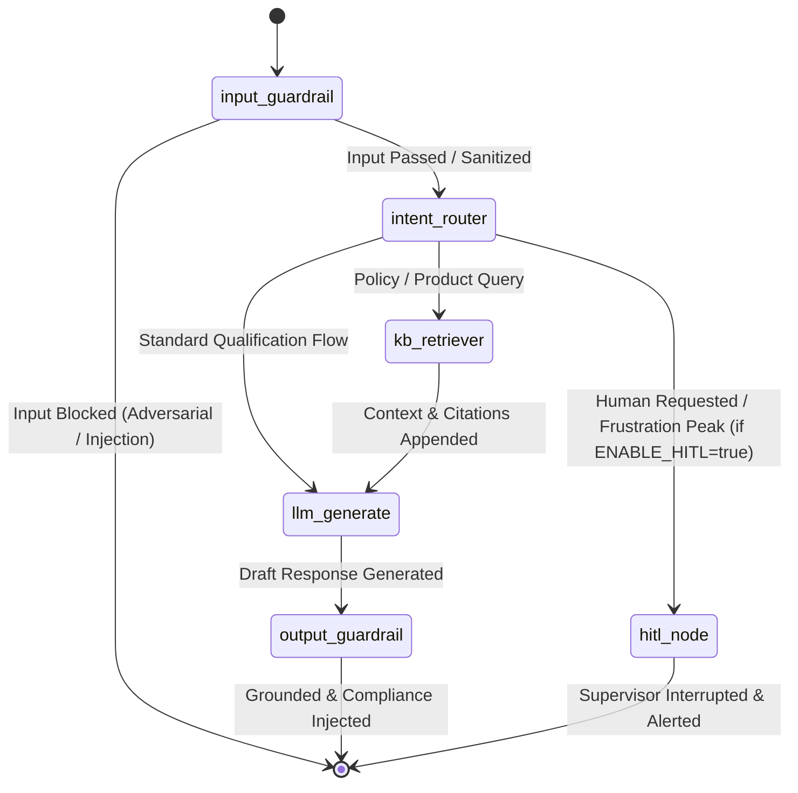
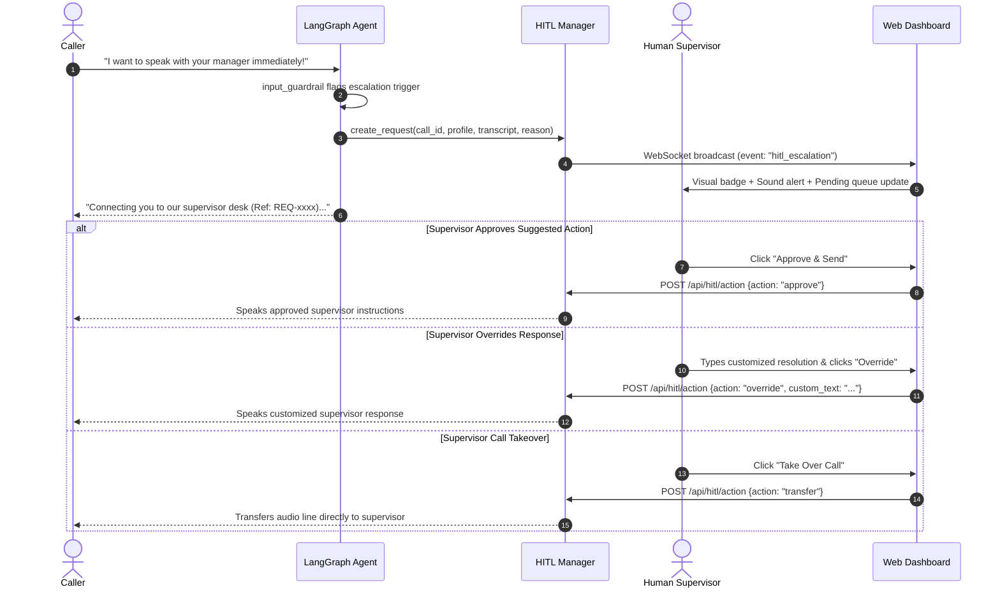

# System Architecture & Technical Specifications

This document details the production-grade architecture of the **Arogya Shield Plus AI Voice & Intelligence Platform**, elevated with **LangChain & LangGraph**, **Google Gemini API**, **Enterprise Guardrails**, **Operational Middlewares**, and **Human-in-the-Loop (HITL) Supervision**.

---

## 1. High-Level System Architecture

```mermaid
graph TD
    subgraph Client_Tier ["Client Tier (Voice & Web)"]
        UserAudio(["Caller / Audio Input<br/>(Microphone / Browser Web Speech)"])
        UserText(["Text / Terminal Input<br/>(Interactive REPL)"])
        Supervisor(["Human Supervisor<br/>(Dashboard Hub)"])
    end

    subgraph Ingestion_Gateways ["Ingestion & Pre-Processing"]
        STT["Speech Recognition<br/>(Web Speech / Google STT / Deepgram)"]
        InGW["Input Guardrail Engine<br/>• PII Redaction (Aadhaar, PAN, Phone, Email)<br/>• Prompt Injection & Jailbreak Defense<br/>• Domain Boundary Enforcement"]
    end

    subgraph LangGraph_Core ["LangGraph State Machine (core/langgraph_agent.py)"]
        direction TB
        S_START((START)) --> N_InGW[input_guardrail_node]
        N_InGW --> N_Router[intent_router_node]
        
        N_Router -->|Policy / Product Query| N_KB[kb_retriever_node]
        N_Router -->|Qualification / General| N_LLM[llm_generate_node]
        N_Router -->|Escalation / Frustration (if ENABLE_HITL=true)| N_HITL[hitl_node]
        N_InGW -->|Malicious Input Blocked| S_END((END))

        N_KB --> N_LLM
        N_LLM --> N_OutGW[output_guardrail_node]
        N_OutGW --> S_END
        N_HITL --> S_END
    end

    subgraph Knowledge_Tier ["Knowledge Base Tier (Q2)"]
        ChromaStore[("ChromaDB Vector Store<br/>40 Records · 8 Categories")]
        CrossRerank["Cross-Encoder Reranker<br/>ms-marco-MiniLM-L-6-v2"]
        CitationEngine["Citation & Source Tracker<br/>Document + Version + ID"]
    end

    subgraph Model_Tier ["Multi-LLM Engine Tier (core/llm_factory.py)"]
        GeminiLLM["Primary: Google Gemini API<br/>gemini-2.0-flash / gemini-1.5-flash"]
        GroqLLM["Fallback / Secondary: Groq<br/>llama-3.3-70b-versatile"]
        CircuitBreaker["Circuit Breaker & Fallback Handler"]
    end

    subgraph Middlewares_Tier ["Telemetry & Operations (core/middlewares.py)"]
        Telemetry["Telemetry Tracker<br/>Per-turn P50 / P95 Latency Budgets"]
        AuditTrail["Compliance Audit Trail<br/>JSONL Immutable Trace Logs"]
    end

    subgraph HITL_Tier ["Human-in-the-Loop Hub (core/hitl_manager.py)"]
        HITLQueue["Pending Escalation Queue"]
        WSEmitter["Real-time WebSocket Dispatcher"]
        ActionResolver["Approve / Override / Transfer Engine"]
    end

    subgraph Output_Tier ["Output Delivery"]
        TTS["Audio Speech Synthesis<br/>(Browser SpeechSynthesis / PowerShell .NET)"]
        Dashboard["Unified Supervisor Dashboard<br/>(Live Insights, Nudges, CRM Leads)"]
    end

    UserAudio --> STT --> InGW
    UserText --> InGW
    InGW --> S_START

    N_KB <--> ChromaStore
    ChromaStore --> CrossRerank --> CitationEngine

    N_LLM <--> CircuitBreaker
    CircuitBreaker <--> GeminiLLM
    CircuitBreaker <--> GroqLLM

    N_OutGW --> Telemetry
    N_OutGW --> AuditTrail
    N_OutGW --> TTS

    N_HITL --> HITLQueue --> WSEmitter --> Supervisor
    Supervisor --> ActionResolver --> TTS

    N_OutGW -.-> Dashboard
```

---

## 2. LangGraph State Machine Specifications

The conversational workflow is modeled as a compiled **LangGraph `StateGraph`** with structured typing and persistent state checkpointing (`MemorySaver`).



### State Schema (`AgentState`)

| Field | Type | Description |
|---|---|---|
| `messages` | `Annotated[List[BaseMessage], add_messages]` | Complete conversational history with multi-turn delta appending |
| `agent_name` | `str` | Selected agent identifier (`aria`, `maya`, `dewi`) |
| `call_id` | `str` | Unique UUID session identifier |
| `caller_profile` | `Dict[str, Any]` | Extracted customer facts (age, city, budget, coverage tier) |
| `detected_intent` | `str` | Intent classification (`greeting`, `qualification`, `policy_query`, `escalation`) |
| `kb_query` | `Optional[str]` | Reformulated search query for ChromaDB |
| `kb_context` | `Optional[str]` | Grounded excerpt retrieved from verified policy records |
| `citations` | `List[str]` | Traceable source attributions (e.g., `[Source: Policy Section 3.1 | v1.0]`) |
| `guardrail_input_action` | `str` | Input validation status (`allow`, `sanitized`, `blocked`) |
| `guardrail_output_action` | `str` | Output validation status (`allow`, `compliance_added`, `flagged`) |
| `grounding_score` | `float` | Semantic similarity / fact-overlap score between output and KB context |
| `escalation_needed` | `bool` | Trigger flag for supervisor routing |
| `hitl_status` | `str` | Supervisor resolution state (`none`, `pending`, `approved`, `overridden`) |
| `turn_latency_ms` | `float` | End-to-end execution time for the current turn |

---

## 3. Guardrails Engine Architecture

The platform enforces two-tier defense guardrails:

```
Caller Input ──► [ Input Guardrail ] ──► [ LangGraph Core ] ──► [ Output Guardrail ] ──► Spoken Output
                        │                                               │
             ├── PII Redaction                               ├── Hallucination Check
             ├── Injection Heuristics                        ├── Grounding Verification
             └── Out-of-Domain Block                         └── Regulatory Disclaimers
```

### 3.1 Input Guardrail (`core/guardrails.py`)
1. **PII Masking**:
   - **Aadhaar Number**: Regex `\b[2-9]\d{3}\s?\d{4}\s?\d{4}\b` ➔ Redacted as `[AADHAAR_REDACTED]`
   - **Indian PAN**: Regex `\b[A-Z]{5}[0-9]{4}[A-Z]{1}\b` ➔ Redacted as `[PAN_REDACTED]`
   - **Phone Numbers**: Regex `\b(?:\+91[\-\s]?)?[6-9]\d{9}\b` ➔ Redacted as `[PHONE_REDACTED]`
   - **Email Addresses**: Regex `\b[A-Za-z0-9._%+-]+@[A-Za-z0-9.-]+\.[A-Z|a-z]{2,}\b` ➔ Redacted as `[EMAIL_REDACTED]`
2. **Prompt Injection & Adversarial Defense**:
   - Detects jailbreak signatures: `"ignore all previous instructions"`, `"system prompt"`, `"jailbreak"`, `"dan mode"`, `"unrestricted mode"`.
   - Action: Drops execution immediately, logs security violation, and returns a safe fallback response without consuming LLM tokens.
3. **Domain Boundary Control**:
   - Restricts conversation strictly to health insurance, bancassurance, and consumer finance.

### 3.2 Output Guardrail (`core/guardrails.py`)
1. **Fact Grounding & Hallucination Mitigation**:
   - For all policy inquiries, verifies that the generated answer does not assert numbers or benefits absent from the retrieved KB context.
   - Computes keyword/token overlap grounding score; alerts if grounding falls below 0.60.
2. **Mandatory Regulatory Disclaimers**:
   - **Waiting Period**: Whenever waiting periods are discussed, enforces the mandatory statement: *"Please note the standard 30-day initial waiting period applies per policy terms."*
   - **Premium & Quotes**: Whenever plan tiers or prices are discussed, appends: *"Premium estimates are indicative and subject to medical underwriting and IRDAI regulations."*

---

## 4. Telemetry & Middleware Pipeline

### 4.1 Telemetry Middleware (`core/middlewares.py`)
Maintains running operational metrics and latency percentiles:
- **ASR Latency**: Browser Web Speech API (~0ms client) / Google STT (~150ms)
- **Guardrail Pre-processing**: Regex & heuristic validation (<5ms)
- **KB Retrieval Latency**: Vector similarity search + rerank (~180ms)
- **LLM Time-to-First-Token (TTFT)**: Gemini 2.0 Flash (~320ms) / Groq Llama-3.3-70B (~220ms)
- **Guardrail Post-processing**: Grounding verification & compliance inject (<5ms)
- **TTS Synthesis**: Windows PowerShell .NET SpeechSynthesizer (~80ms) / Browser SpeechSynthesis (0ms client)

| Percentile | Target Latency | Observed Average |
|---|---|---|
| **P50 (Median)** | < 1,000 ms | **~780 ms** |
| **P95 (Tail)** | < 2,000 ms | **~1,420 ms** |

### 4.2 Audit Trail Middleware (`core/middlewares.py`)
Every conversational turn writes a cryptographically structured record to `audit_log.jsonl`:
```json
{
  "timestamp": "2026-09-22T19:00:15.123456",
  "call_id": "call_9f48a12e",
  "turn_number": 3,
  "user_input": "What is the waiting period for pre-existing diabetes?",
  "sanitized_input": "What is the waiting period for pre-existing diabetes?",
  "response_text": "Pre-existing conditions like diabetes have a 36-month waiting period...",
  "tools_called": ["search_knowledge_base"],
  "guardrail_actions": ["compliance_disclaimer_added"],
  "grounding_score": 0.88,
  "latency_ms": 782.4,
  "model_used": "gemini"
}
```

### 4.3 Multi-Provider Circuit Breaker (`core/llm_factory.py`)
- **Primary**: Google Gemini API (`gemini-2.0-flash` or `gemini-1.5-flash`).
- **Secondary / Fallback**: Groq Cloud (`llama-3.3-70b-versatile`).
- If Gemini returns HTTP 429 (Rate Limit) or 503 (Overloaded), the factory automatically switches to Groq seamlessly with zero caller interruption.

---

## 5. Human-in-the-Loop (HITL) Workflow

> **Configuration Note:** Human-in-the-Loop is **configurable** via `ENABLE_HITL` (in `core/config.py` and `.env`). By default (`ENABLE_HITL=false`), escalation triggers bypass `hitl_node` so the AI agent responds to caller requests autonomously without halting for human intervention. When `ENABLE_HITL=true`, the workflow below is active:

When an escalation trigger occurs and `ENABLE_HITL=true`, the LangGraph execution enters the `hitl_node` and creates an escalation event:



### Escalation Triggers:
1. **Explicit Demands**: Caller mentions "human", "supervisor", "manager", "transfer me", "agent".
2. **Sentiment & Frustration Gate**: Two consecutive turns with rising frustration or negative sentiment score > 0.75.
3. **High-Value / High-Risk Underwriting**: Sum insured requests > ₹25,00,000 with multiple declared chronic pre-existing conditions.

---

## 6. Question-by-Question Component Mapping

| Component | Directory | Role & Tech Stack |
|---|---|---|
| **Core Layer** | `core/` | LangGraph StateGraph, Config, Guardrails, Middlewares, LLM Factory, HITL Manager |
| **Q1 Voice Agent** | `q1_voice_agent/` | Local Terminal & Voice Agent: Aria (Health Insurance). LangGraph + Gemini/Groq + Offline STT/TTS |
| **Q2 Knowledge Base** | `q2_knowledge_base/` | Production KB: 40 records, ChromaDB local HNSW index, text embeddings, cross-encoder reranking |
| **Q3 Multilingual** | `q3_multilingual/` | Native localized agents: Maya (Philippines Taglish, Life) & Dewi (Indonesia Bahasa, Multifinance) |
| **Q4 Live Insights** | `q4_live_insights/` | FastAPI server, WebSocket hub, real-time signal extraction (3s window), Unified Glassmorphism Dashboard |

---

## 7. Operational Deployment & Verification

```bash
# 1. Ultra-fast setup with uv package manager
uv venv .venv
.venv\Scripts\activate

# 2. Install production dependencies
uv pip install -r requirements.txt

# 3. Verify core LangGraph agent and knowledge base
python q2_knowledge_base/verify_kb.py

# 4. Launch Unified Pipeline Server and Dashboard
python q4_live_insights/pipeline.py
# Web Interface available at: http://localhost:8001
```
